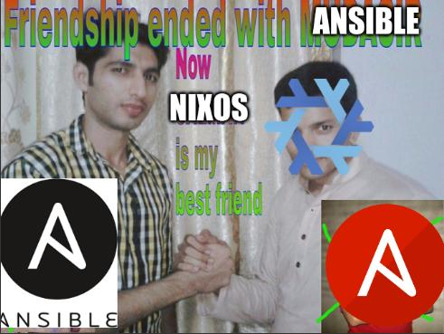

# My NixOS config
So I finally took the plunge. After awhile of hearing about this "hip" and "new" and "cool" declarative OS called NixOS, I finally decided to take the NixOS pill. I grabbed an old laptop. Nabbed the [NixOS installer w/GNOME](https://channels.nixos.org/nixos-24.05/latest-nixos-gnome-x86_64-linux.iso) from the site and gave it a spin.

What started off as a fairly harmless pilot exercise has turned into what some would call an obsession. Its pretty incredible what the distro can do. I absolutely think I can replace NixOS with all of my ansible playbooks now.

# This repo
So this repo will serve as the location of my current NixOS config and "roadmap" of things I would like to learn or otherwise configure for my NixOS machines. This repo was setup with help and guidance from `Enron5` on the NixOS community forums - [thread](https://discourse.nixos.org/t/using-git-to-handle-and-manage-configuration-nix/38337/4)

### To-do

- [ ] Declarative config for setting up and using Docker/Podman
- [ ] Declarative config set the icon/theme
- [ ] Declarative config to set the background
- [ ] Investigate/use flakes
- [ ] Investigate/use home-manager
- [ ] Research and implement best practice for managing NixOS config
- [ ] Replace existing ansible playbooks w/NixOS configs

Like this? Cool. Take it, us it, enjoy it. 
